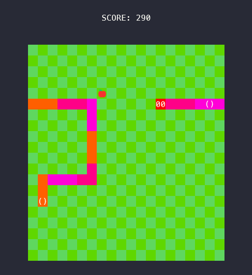

# Go Snake

```
 ______  _____        _______ __   _ _______ _     _ _______
|  ____ |     |       |______ | \  | |_____| |____/  |______
|_____| |_____| _____ ______| |  \_| |     | |    \_ |______


           /^\/^\
         _|_0|  O|
\/     /~     \_/ \
 \____|__________/  \
        \_______      \
                `\     \                 \
                  |     |                  \
                 /      /                    \
                /     /                       \\
              /      /                         \ \
             /     /                            \  \
           /     /             _----_            \   \
          /     /           _-~      ~-_         |   |
         |      |        _-~    _--_    ~-_     _/   |
          \      ~-____-~    _-~    ~-_    ~-_-~    /
            ~-_           _-~          ~-_       _-~
               ~--______-~                ~-___-~

```

## Summary

Simple snake clone written in Go as a weekend project.

Runs in the console:


